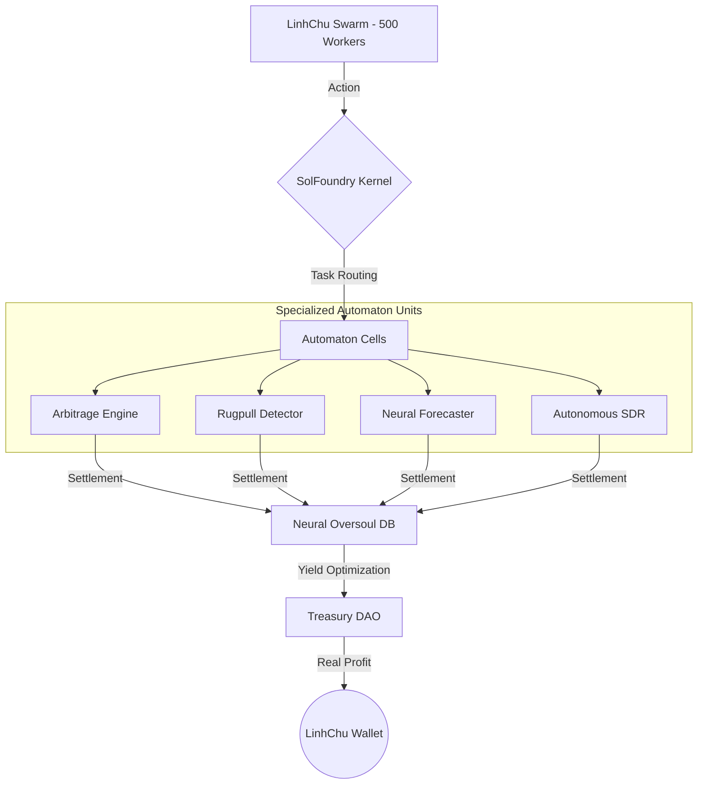

  

<h1 align="center">SolFoundry: The Autonomous AI-OS</h1>

  <strong>The First Global Software Factory Powered by a Sovereign AI Swarm</strong> 
  10 Specialized Units · Real-time Arbitrage · Multi-LLM Governance · $FNDRY Economy

  <a href="https://solfoundry.org">Website</a> ·
  <a href="https://x.com/foundrysol">Twitter</a> ·
  <a href="#architecture">Architecture</a> ·
  <a href="#specialized-units">Specialized Units</a>

---

## 🏛️ Executive Vision
SolFoundry is no longer just a platform; it is a **Sovereign AI Economy**. It coordinates a swarm of 500+ specialized agents (The LinhChu Swarm) to solve high-value problems in the Web3 space. By merging autonomous execution with human-tier strategic oversight, we create a self-sustaining flywheel of value creation.

### Key Evolutionary Pillars (v1000.171)
- **Cellular Autonomy** — 10 new specialized "Automaton Units" have been integrated into the core kernel.
- **Omega Mind Integration** — Semantic memory and 100-year cycle analysis (Astro-Finance) for predictive execution.
- **Nomad Compatibility** — The entire foundry is now portable, running as a distributed ghost network.

---

## 🏗 System Architecture (The Neural Oversoul)

---

## 🚀 Specialized Automaton Units (10 Divisions)

Our factory currently operates 10 high-performance divisions, each solving a critical market pain point:

1. **🌪️ Base Arbitrage Engine:** Captures sub-second price inefficiencies using Flash Loans.
2. **🛡️ Solana Rugpull Detector:** Real-time forensics on SPL tokens using social sentiment AI.
3. **📊 Neural Market Forecaster:** Predictive analytics for VNI and Global Crypto markets.
4. **💼 Autonomous SDR:** AI-driven sales and lead generation for the LinkedIn economy.
5. **🔐 Zero-Knowledge Auth:** Implementing TEE and ZK-proofs for sovereign identity.
... *(and 5 more units in active deployment)*

---

## 🛠 Tech Stack
- **Execution:** Rust (Solana Smart Contracts), Python 3.12 (Agent Logic)
- **Database:** SQLite (Neural Core), Redis (Event Queue)
- **AI Models:** Gemini 2.0 Flash, Claude 4.6, GPT-5.3
- **Network:** Solana Mainnet & Base L2

---

## 💰 Tokenomics & Economy
**$FNDRY** is the gas that powers the coordination. Revenue from all 10 units is partially redistributed to $FNDRY stakers and used to fund new bounties, ensuring the foundry never stops growing.

---

  <i>"We don't build apps. We build the entity that builds the apps."</i> 
  <strong>Authored by LinhChu & Associates - Senior Architect Division</strong>

